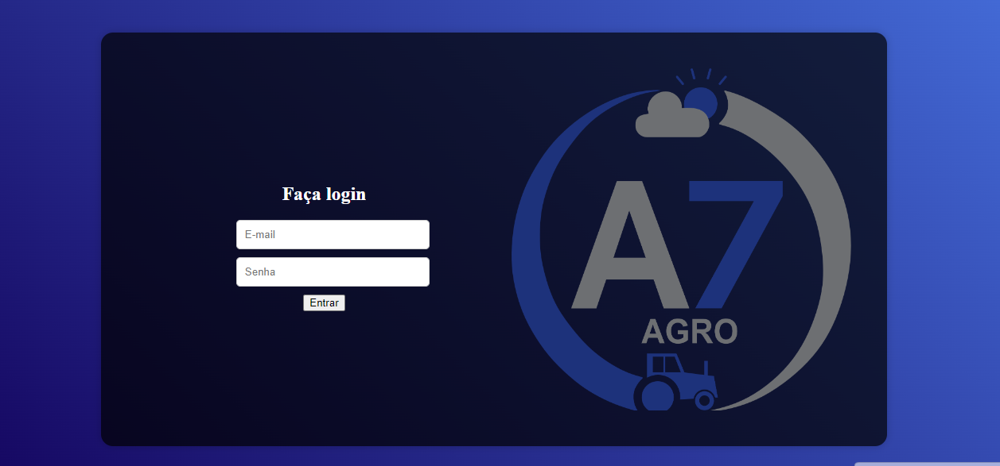
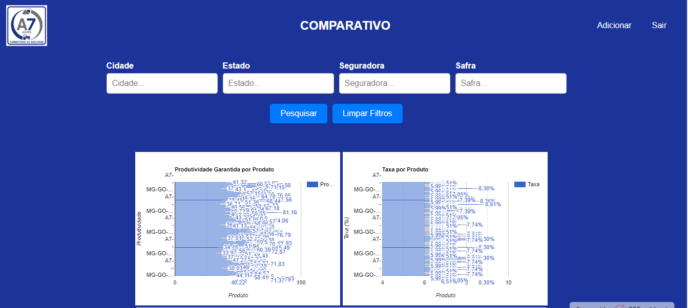
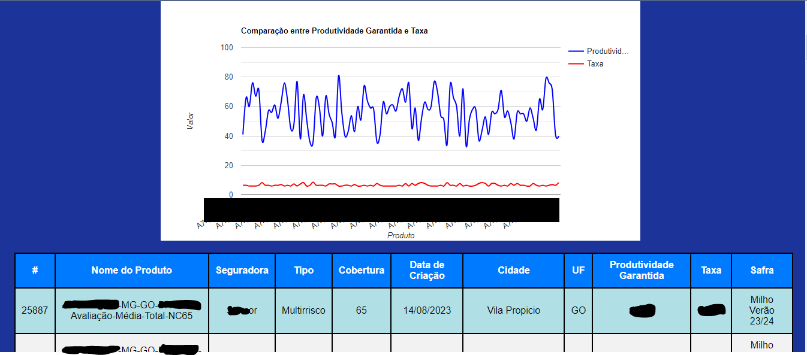

# Comparativo de Condições: Antes e Depois

Nosso comparativo de condições oferece uma maneira simples e eficaz de visualizar e avaliar as mudanças nas condições, sejam elas em contratos, acordos ou políticas. Com uma tela de login intuitiva, você pode comparar facilmente as condições antigas com as novas, identificando todas as diferenças cruciais.

Recursos Principais:

Tela de Login Segura: Comece por fazer login de forma segura, garantindo que apenas os usuários autorizados tenham acesso às informações sensíveis.

Comparação Visual: Nossa plataforma fornece uma representação visual clara das condições antigas e novas lado a lado. Isso torna fácil identificar alterações e diferenças significativas.

Realce de Diferenças: As discrepâncias entre as condições antigas e novas são realçadas para que você possa identificá-las instantaneamente. Isso economiza tempo e reduz a chance de erros.

Detalhes Completos: Clique em qualquer diferença destacada para obter detalhes completos sobre a alteração, incluindo descrições, datas efetivas e implicações.

Rastreamento de Versão: Mantemos um histórico de todas as versões anteriores para que você possa acessar registros e trilhas de auditoria sempre que necessário.

Colaboração Simplificada: Compartilhe facilmente as comparações com outras partes interessadas, permitindo uma colaboração eficiente na tomada de decisões.

Benefícios:

Tomada de Decisão Informada: Compreenda completamente as alterações nas condições, permitindo tomar decisões informadas.

Transparência: Promova a transparência e a confiança nas negociações e acordos.

Economia de Tempo: Evite a necessidade de examinar manualmente documentos longos em busca de alterações.

Conformidade: Garanta a conformidade com regulamentos e requisitos legais.

Histórico Acessível: Mantenha um registro histórico acessível para referência futura.

O nosso comparativo de condições é a ferramenta essencial para qualquer pessoa que precise avaliar e entender as mudanças nas condições contratuais. Desde a gestão de contratos empresariais até a análise de políticas, nossa plataforma simplifica o processo e ajuda a garantir que você esteja sempre ciente das mudanças que afetam seus interesses. Faça login agora e comece a comparar com confiança!
